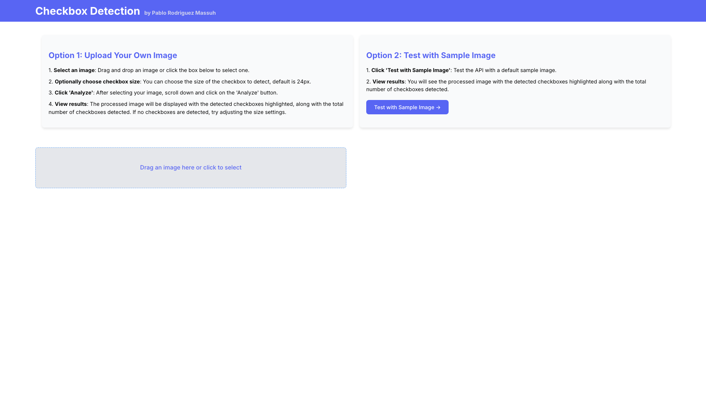
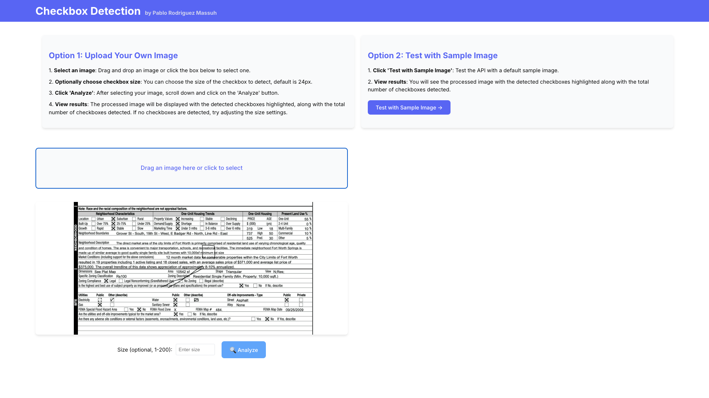
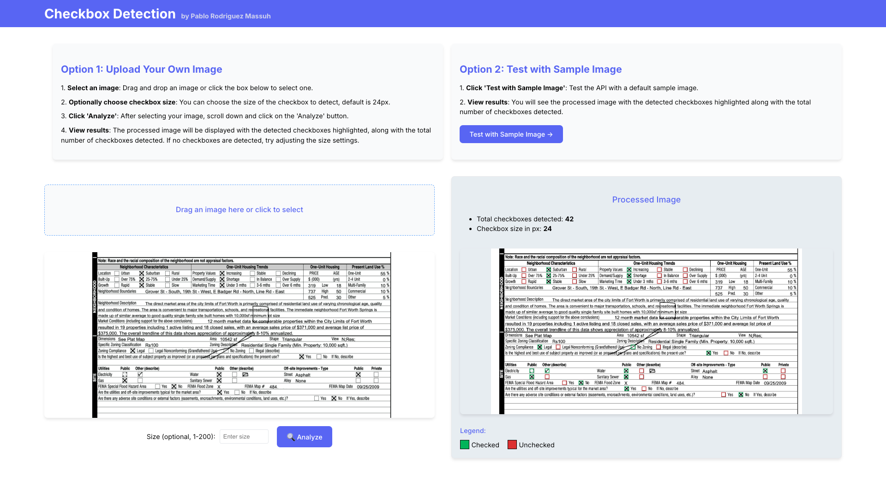

# Checkbox Detection App

This application allows you to detect checkboxes in images through an API with a user-friendly interface. You can test it directly from the deployed Heroku app:

- 🖥️ [Access the web app](https://home-vision-challenge-front-c115138f33e2.herokuapp.com/)
- 🌐 [Production API](https://home-vision-challenge-d4dde1803160.herokuapp.com/)

---

## ✨ Main Features
- **Detection** of checkboxes in uploaded **jpg** images.
- **Interactive interface** to upload images and visualize results.
- **RESTful API** available for custom integrations.
- **Deployed on Heroku** for instant access.

---

## 🚀 How to Use the Application
You can use the [web interface](https://home-vision-challenge-front-c115138f33e2.herokuapp.com/) to upload images and see the checkbox detection results in real-time. Alternatively, you can interact directly with the API (instructions below).

---

## 🖥️ Using the Web Interface
1. **Open the web application:**  
   Click here 👉 [Go to the app](https://home-vision-challenge-front-c115138f33e2.herokuapp.com/)

2. **Upload an image:**  
   Click on the upload area or drag and drop an image.

3. **View the results:**  
   The app will display the processed image with detected checkboxes highlighted.

### 📷 Visual Example of the Process

| Step | Image                                     |
|------|-------------------------------------------|
| 1️⃣  |       |
| 2️⃣  |  |
| 3️⃣  |         |
---

## 🛠️ Using the API Directly
You can interact with the API in two ways:

### 1️⃣ **GET Request (For Testing Purposes Only)**
This method returns a detection using a predefined test image.

#### 📩 Example GET Request
```
GET /checkbox
```

#### ✅ Example Response
```json
{
  "image_name": "test-image.jpg",
  "total_detections": 42,
  "checkbox_size_in_pixels": 24,
  "image_with_checkboxes_url": "/response/image_with_checkboxes.jpg",
  "checkboxes": [
    { "x": 156, "y": 96, "status": "unchecked" },
    { "x": 282, "y": 96, "status": "checked" }
  ]
}
```

### 2️⃣ **POST Request (Primary Usage)**
Upload your own image to receive checkbox detection results.

#### 📩 Example POST Request with cURL
```bash
curl -X POST \
     -F "image=@/path/to/your-image.jpg" \
     "https://home-vision-challenge-d4dde1803160.herokuapp.com/checkbox?size=24"
```

#### ✅ Example Response
```json
{
  "image_name": "your-image.jpg",
  "total_detections": 30,
  "checkbox_size_in_pixels": 24,
  "image_with_checkboxes_url": "/response/image_with_checkboxes.jpg",
  "checkboxes": [
    { "x": 120, "y": 85, "status": "checked" },
    { "x": 245, "y": 90, "status": "unchecked" }
  ]
}
```

### 🧪 Running Locally with Custom Images
If you run the project locally, you can test detection by either:
- Replacing the test image in the `test/` folder with your own and send a **GET request**.
- Sending a **POST request** with a new image to your local server.

#### Example Local POST Request
```bash
curl -X POST \
     -F "image=@/path/to/your-image.jpg" \
     "http://localhost:8080/checkbox?size=24"
```

This flexibility allows you to test quickly or use your own images for more accurate detection results.

## 🧪 Running Locally
If you want to test the app on your local machine:

1. **Clone the repository:**
   ```bash
   git clone https://github.com/xpitr256/home-vision-challenge.git
   cd home-vision-challenge
   ```
2. **Start the application:**
   ```bash
   go run main.go
   ```
3. **Access the interface:**  
   Visit `http://localhost:8080` in your browser.

---

## 🚧 Potential Improvements
- Optimize detection accuracy with improved algorithms.
- Support additional image formats beyond jpg
- Add a recent uploads history feature.